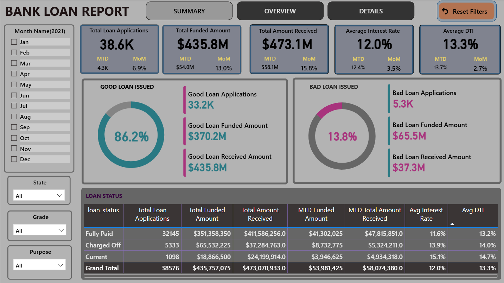
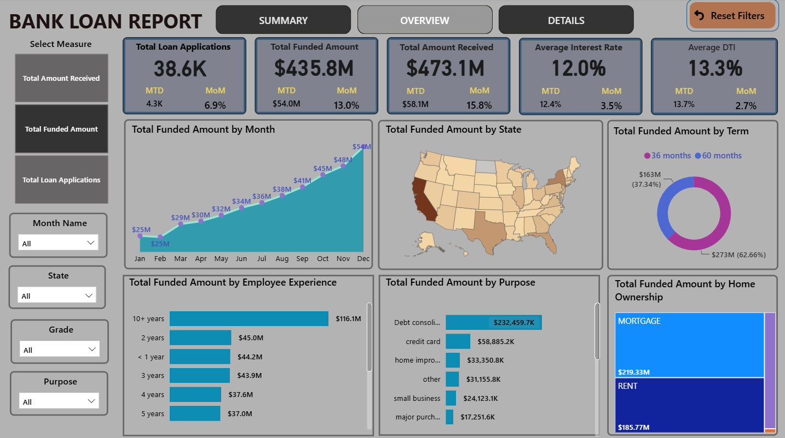
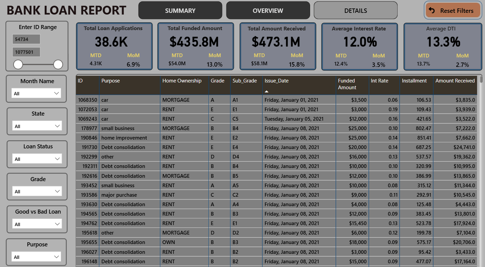

# Bank Loan Analytics Dashboard

An interactive Power BI dashboard analyzing 38.6K+ bank loan applications to track loan performance, funding trends, and risk segmentation.

## Objective
Banks need to monitor loan portfolio health — how much is being funded, how much is being recovered, and which loans are performing well vs. poorly. This dashboard answers:
- What's the overall volume and value of loans issued?
- How does loan performance vary by state, purpose, grade, and borrower profile?
- What proportion of loans are "Good" (Fully Paid/Current) vs. "Bad" (Charged Off)?

## Dataset
- Source: Included in this repo (`dataset/financial_loan.csv`)
- Size: ~38,576 loan records
- Key fields: Loan ID, Funded Amount, Interest Rate, DTI, Grade, Purpose, Home Ownership, Issue Date, Loan Status

## Tools Used
- Power BI Desktop
- SQL (data extraction and querying)
- DAX (measures for MTD, MoM, KPI calculations)
- Power Query (data cleaning/transformation)

## Dashboard Pages

### 1. Summary
KPI overview with MTD/MoM tracking, Good vs. Bad Loan classification, and a loan status breakdown table.


### 2. Overview
Trend analysis by month, state (map), term, employee experience, purpose, and home ownership.


### 3. Details
Record-level drill-down table with ID range filtering and full slicer controls.


## Key Insights
- 86.2% of loans are classified as "Good" (Fully Paid/Current), with only 13.8% Charged Off
- Charged Off loans carry a higher average interest rate (13.9%) than Fully Paid loans (11.6%), suggesting risk-based pricing
- Debt consolidation is the dominant loan purpose, accounting for the largest share of funded amount
- Mortgage holders account for the majority of funded amount ($219M) vs. renters ($185M)

## Key DAX Measures

```dax
Good Loan % = (CALCULATE([Total Loan Applications], financial_loan[Good vs Bad Loan] = "Good Loan"))/[Total Loan Applications]
```

```dax
MTD Loan Applications = CALCULATE(TOTALMTD([Total Loan Applications], 'DATE TABLE'[Date]))
```

```dax
MTD Avg Int Rate = CALCULATE(TOTALMTD([Avg Interest Rate], 'DATE TABLE'[Date]))
```

```dax
MOM Avg DTI = ([MTD Avg DTI] - [PMTD Avg DTI])/[PMTD Avg DTI]
```

```dax
PMTD Total Amount Received = CALCULATE([Total Amount Received],DATESMTD(DATEADD('DATE TABLE'[Date],-1,MONTH)))
```

## Field Parameter

```dax
Select Measure = {
    ("Total Amount Received", NAMEOF('financial_loan'[Total Amount Received]), 0),
    ("Total Funded Amount", NAMEOF('financial_loan'[Total Funded Amount]), 1),
    ("Total Loan Applications", NAMEOF('financial_loan'[Total Loan Applications]), 2)
}
```

## SQL Queries
Used SQL to validate and explore key metrics before building visuals in Power BI.

```sql
select * from financial_loan
```

**Good Loan %**
```sql
/* GOOD LOAN */
select (count(case when loan_status = 'Fully paid' OR loan_status = 'Current' then id end)) *100
      / count(id) as good_loan_percentage
from financial_loan;
```

**Good Loan Applications**
```sql
select count(id) as good_loan_applications from financial_loan
where loan_status = 'Fully paid' OR loan_status = 'Current';
```

**Monthly Trend**
```sql
SELECT 
	MONTH(issue_date) AS Month_Number, 
	DATENAME(MONTH, issue_date) AS Month_Name, 
	COUNT(id) AS Total_Loan_Applications,
	SUM(loan_amount) AS Total_Funded_Amount,
	SUM(total_payment) AS Total_Amount_Received
FROM financial_loan
GROUP BY MONTH(issue_date), DATENAME(MONTH, issue_date)
ORDER BY MONTH(issue_date);
```

**Regional Breakdown**
```sql
SELECT 
	address_state,
	COUNT(id) AS Total_Loan_Applications,
	SUM(loan_amount) AS Total_Funded_Amount,
	SUM(total_payment) AS Total_Amount_Received
FROM financial_loan
GROUP BY address_state
ORDER BY COUNT(id) desc;
```

## How to Use
1. Download `Bank_Loan_Report.pbix`
2. Open in Power BI Desktop
3. Explore interactively using the slicers and filters on each page

## Contact
Pranjal Mangal | Pranjalmangal624@gmail.com
